# 🧠 Algorithm Documentation

## Table of Contents
1. [YOLOv5 Architecture](#yolov5-architecture)
2. [Data Flow Pipeline](#data-flow-pipeline)
3. [Training Process](#training-process)
4. [Inference Pipeline](#inference-pipeline)

---

## YOLOv5 Architecture

### Architecture Components:
1. **Focus Layer**: Reduces spatial dimensions while increasing channel depth
2. **BottleneckCSP**: Cross Stage Partial Network for better gradient flow
3. **SPP Layer**: Spatial Pyramid Pooling for multi-scale feature extraction
4. **PANet**: Path Aggregation Network for better feature fusion
5. **Detection Head**: Predicts bounding boxes and class probabilities

---

## Data Flow Pipeline

### Preprocessing Steps:
1. Frame extraction at 5 FPS
2. Resize to 640x640
3. Normalize pixel values
4. Apply augmentations (Mosaic, MixUp, HSV)

---

## Training Process

```mermaid
%%{init: {'theme': 'base', 'themeVariables': { 'primaryColor': '#fff3bf', 'primaryBorderColor': '#ffd43b'}}}%%
graph LR
    A[Initialize Model] --> B[Load Dataset]
    B --> C[Forward Pass]
    C --> D[Compute Loss]
    D --> E[Backpropagation]
    E --> F[Update Weights]
    F --> C
    D --> G[Validation]
    G -->|mAP > Best| H[Save Checkpoint]
    G -->|mAP ≤ Best| C
```

### Training Parameters:
- **Optimizer**: SGD with momentum (0.937)
- **Learning Rate**: 0.01 with cosine annealing
- **Batch Size**: 16
- **Epochs**: 100
- **Loss Function**: CIoU Loss + BCE Loss

---

## Inference Pipeline

### Post-processing:
1. **Confidence Thresholding**: Remove predictions < 0.25 confidence
2. **NMS**: IoU threshold of 0.45 to remove overlapping boxes
3. **Label Mapping**: Convert class IDs to human-readable labels

---

## Performance Optimization

### Optimization Details:
- **Mixed Precision**: FP16 training for faster computation
- **Data Augmentation**: Mosaic, MixUp, HSV, and perspective transforms
- **Learning Rate**: Cosine annealing with warmup
- **Weight Decay**: 0.0005 for regularization

---

## Class Distribution

### Dataset Statistics:
- Total samples: 412 videos
- 8 balanced classes
- 5 frames extracted per video
- Train/Val/Test split: 70%/15%/15%

---

## Model Performance

### Performance Metrics:
- **YOLOv5s**: 94.0 mAP@0.5
- **Inference Speed**: 15 FPS on CPU, 45 FPS on GPU
- **Model Size**: 14.4 MB (FP32), 7.2 MB (FP16)

---

## Real-time Processing

### Real-time Features:
- Multi-threaded frame capture
- Asynchronous processing
- FPS counter and performance metrics
- Real-time visualization

---

## Future Enhancements

### Planned Features:
1. **Multi-hand Detection**
2. **Expanded Vocabulary**
3. **Mobile Application**
4. **Cloud API**
5. **User Authentication**

---

## Color Legend

### Diagram Colors:
- 🔵 **Blue**: Input/Output operations
- 🟢 **Green**: Data processing
- 🟡 **Yellow**: Training process
- 🟣 **Purple**: Optimization techniques
- 🔴 **Red**: Data analysis
- 🟢 **Teal**: Real-time inference

---

*Last Updated: November 14, 2025*
