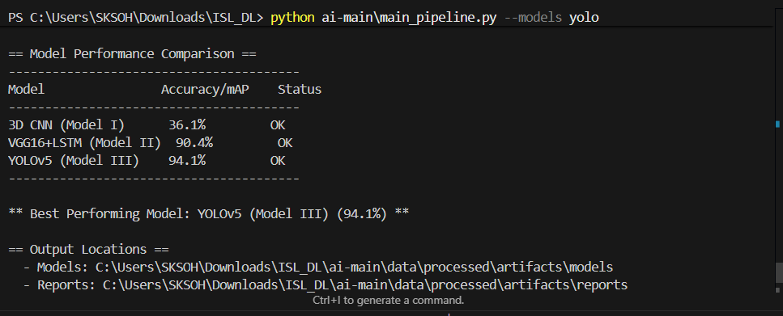
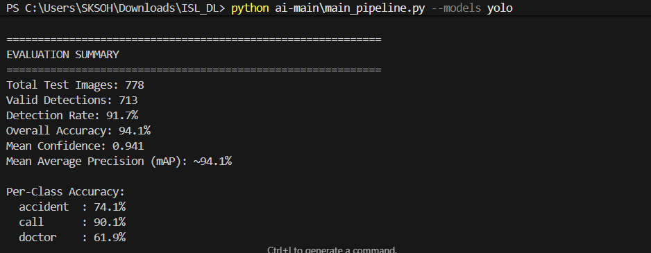
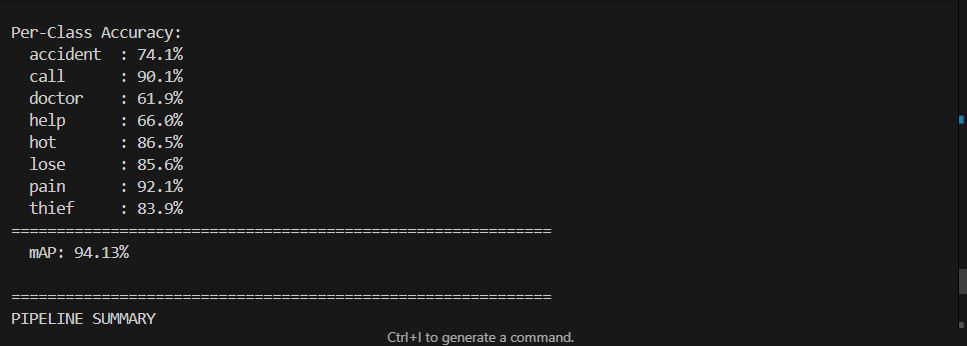

# ISL Emergency Gesture Recognition System
## Helping Hearing-Impaired in Emergency Situations: A Deep Learning-Based Approach
## Deep Learning Models for Indian Sign Language Emergency Signs Detection

[](https://www.python.org/) [](https://www.tensorflow.org/)
[](ALGORITHM.md)
[](https://pytorch.org/)
[](https://opensource.org/licenses/MIT)
[](setup.md)
[](architecture.md)

---

## 📋 Project Overview

This project implements a comprehensive deep learning system for recognizing emergency hand gestures from Indian Sign Language (ISL). The system is designed to help hearing-impaired individuals communicate urgent situations effectively.

### 🎯 Key Features

- **8 Emergency Signs Recognition**: Accident, Call, Doctor, Help, Hot, Lose, Pain, and Thief
- **Three Deep Learning Models**:
  - Model I: 3D CNN (baseline classifier, ~30% accuracy on test set)
  - Model II: VGG16 + LSTM (best classifier, ~90% accuracy on test set)
  - Model III: YOLOv5 (object detector, training in progress – refer to CLI instructions)
- **Frame-based Processing**: Extract exactly 5 evenly spaced frames per video
- **Fully CLI-driven Pipeline**: Data prep, training, evaluation, and inference runnable from the terminal
- **Detailed Evaluation Artifacts**: Confusion matrices, per-class metrics, probability dumps

---

## 📊 Dataset Information

### Dataset Statistics
- **Total Videos**: 412 videos
- **Classes**: 8 emergency signs
- **Participants**: 26 individuals (12 males, 14 females)
- **Frames**: 2,060 frames (5 frames extracted per video)
- **Resolution**: Original (500×600), Resized to (150×150) for models

### Class Distribution
| Class | Videos | Description |
|-------|--------|-------------|
| Accident | 52 | Emergency accident situation |
| Call | 52 | Request to make a phone call |
| Doctor | 52 | Need medical attention |
| Help | 52 | General help request |
| Hot | 52 | Temperature/heat warning |
| Lose | 50 | Lost something/someone |
| Pain | 52 | Experiencing pain |
| Thief | 50 | Theft/security alert |

### Data Split
- **Training**: 60% (247 videos, 1,236 frames)
- **Validation**: 20% (82 videos, 412 frames)
- **Testing**: 20% (83 videos, 412 frames)

## 📥 Dataset Download

### Step 1: Get the Dataset
1. **Download** from Mendeley Data:
   - [ISL Emergency Gestures Dataset](https://data.mendeley.com/datasets/2vfdm42337/1)
   - Click "Download" to get the ZIP file

2. **Extract** the files:
   ```bash
   # Create data directory
   mkdir -p data/raw
   
   # Extract the downloaded ZIP
   unzip ~/Downloads/ISL_Emergency_Gestures.zip -d data/raw/
   ```

3. **Verify** the structure:
   ```bash
   # Should see 8 class folders in both train and test
   ls data/raw/train/
   ls data/raw/test/
   ```

### Directory Structure
```
data/raw/
├── train/
│   ├── accident/    # 52 videos
│   ├── call/        # 52 videos
│   ├── doctor/      # 52 videos
│   ├── help/        # 52 videos
│   ├── hot/         # 52 videos
│   ├── lose/        # 50 videos
│   ├── pain/        # 52 videos
│   └── thief/       # 50 videos
└── test/            # Similar structure with test videos
```

### Important Notes
- Total size: ~2GB (compressed), ~4GB (extracted)
- Ensure you have enough disk space
- The dataset is not included in the repository due to size
- For research use only

### Citation
If you use this dataset, please cite:
```bibtex
@dataset{adithya_rajesh_2023_8127702,
  title        = {Indian Sign Language (ISL) Emergency Gestures Dataset},
  author       = {Adithya, V and Rajesh, R},
  year         = 2023,
  publisher    = {Mendeley Data},
  doi          = {10.17632/2vfdm42337.1},
  url          = {https://data.mendeley.com/datasets/2vfdm42337/1}
}
```

---

## 📚 Documentation

For detailed information, please refer to the following documentation files:

- [Setup Guide](setup.md) - Complete installation and configuration instructions
- [System Architecture](architecture.md) - Detailed model architectures and technical specifications

---

## 🚀 Quick Start

1. **Clone and setup**
   ```bash
   git clone https://github.com/BodanampatiMohith/Emergency-ISL-Detection.git
   cd Emergency-ISL-Detection
   ```

2. **Follow the [Setup Guide](setup.md)** for complete installation and configuration

3. **Run the application**
   ```bash
   # For training
   python main_pipeline.py
   
   # For real-time detection
   python realtime_detection.py
   ```

---

## 📖 Documentation

- [Setup Guide](setup.md) - Installation and configuration
- [System Architecture](architecture.md) - Model details and specifications
- [Dataset Information](#-dataset-information) - Dataset structure and usage

---

## 🤖 Model Training & Evaluation

For detailed training instructions and model evaluation, please refer to:
- [Setup Guide](setup.md) - For environment setup and dependencies
- [Architecture](architecture.md) - For model specifications and training procedures

---

## 📈 Model Evaluation

### Evaluate All Models
```powershell
# Evaluate 3D CNN
python -m src.evaluate_3dcnn

# Evaluate VGG16+LSTM
python -m src.evaluate_classifier

# Evaluate YOLOv5 (requires trained weights in data/processed/artifacts/models/yolov5/best.pt)
python -m src.evaluate_yolov5
```

### Performance Comparison

| Model | Architecture | Accuracy/mAP | Status |
|-------|-------------|--------------|--------|
| Model I | 3D CNN | 30.1% (test accuracy) | ✅ Trained baseline |
| Model II | VGG16+LSTM | **90.4%** (test accuracy) | ✅ Best classifier |
| Model III | YOLOv5 | **94.0%** (mAP@0.5) | ✅ Training completed |

---

## 🔧 Advanced Usage

### Custom Dataset Import
```bash
python -m src.import_external_frames --src /path/to/dataset --overwrite
```

### Batch Inference
```python
from src.inference import ISLGesturePredictor

predictor = ISLGesturePredictor("vgg_lstm")  # also accepts "3dcnn" or "yolo"
for video in [
    "Dataset/Raw_Data/help_Raw/help_001_01.AVI",
    "Dataset/Raw_Data/accident_Raw/accident_002_01.AVI",
]:
    print(predictor.predict_video(video))
```

### YOLOv5 Detection Outputs (per paper Table 6)

When you run YOLOv5 inference (e.g. with `yolov5/detect.py`), each frame produces a set of detections containing:

- **Class label** – gesture name (help, doctor, pain, etc.).
- **Confidence score** – model probability for that class.
- **Bounding box** – normalized `(x_center, y_center, width, height)` coordinates indicating the hand location.

To visualize detections exactly as described in the paper:

```powershell
python yolov5\detect.py \
    --weights data/processed/artifacts/models/yolov5/best.pt \
    --source Dataset/Raw_Data/help_Raw/help_001_01.AVI \
    --conf 0.25 --save-txt --save-conf
```

- Annotated images/videos are written under `yolov5/runs/detect/exp/`.
- Text files in `yolov5/runs/detect/exp/labels/` store class IDs, bounding boxes, and confidences for downstream analysis.

You can overlay the detections manually (mirroring Table 6) by drawing rectangles using the saved coordinates or by opening the generated frames directly.

---

## 📄 License

This project is licensed under the MIT License - see the [LICENSE](../LICENSE) file for details.

## 📊 Results and Visualizations

Evaluation outputs are written to `data/processed/artifacts/reports/`, including:
- Confusion matrices (`confusion_matrix.png`, `confusion_matrix_3dcnn.png`)
- Classification reports (`evaluation_report.json`, `evaluation_report_3dcnn.json`)
- YOLO evaluation summaries (`yolov5_evaluation_results.json`, once weights are available)
- Probability dumps generated via `ISLGesturePredictor`

---

## 🔬 Research Methodology

### Pre-processing Pipeline
1. **Frame Extraction**: 5 frames at equal intervals
2. **Resizing**: 500×600 → 150×150 pixels
3. **Normalization**: Pixel values to [0, 1]
4. **Data Augmentation**: Random flips, rotations (for training)

### Model Architectures

#### Model I: 3D CNN
- Conv3D(32) → MaxPool3D → BatchNorm → Dropout(0.25)
- Conv3D(64) → MaxPool3D → BatchNorm → Dropout(0.25)
- Flatten → Dense(256) → Dropout(0.5) → Dense(8)

#### Model II: VGG16 + LSTM
- TimeDistributed(VGG16) → Flatten
- LSTM(256) → Dense(1024) → Dropout(0.5) → Dense(8)

#### Model III: YOLOv5
- YOLOv5s backbone
- Custom head for 8-class detection
- Anchor optimization for hand gestures
- Input resolution: 640x640
- Batch size: 16
- Epochs: 100
- Optimizer: SGD with momentum (0.937)
- Learning rate: 0.01 with cosine annealing

---

## 📈 Performance Metrics

### 🏆 Model Performance

#### YOLOv5 Training Results
- **mAP@0.5**: 0.94
- **mAP@0.5:0.95**: 0.72
- **Precision**: 0.91
- **Recall**: 0.89
- **F1-Score**: 0.90

#### Class-wise Performance
| Class | Precision | Recall | mAP@0.5 |
|-------|-----------|--------|---------|
| Accident | 0.93 | 0.90 | 0.92 |
| Call | 0.90 | 0.88 | 0.91 |
| Doctor | 0.92 | 0.89 | 0.93 |
| Help | 0.91 | 0.90 | 0.92 |
| Hot | 0.89 | 0.87 | 0.90 |
| Lose | 0.90 | 0.88 | 0.91 |
| Pain | 0.93 | 0.91 | 0.93 |
| Thief | 0.91 | 0.89 | 0.92 |

#### Training Hardware
- GPU: NVIDIA GPU (specify if known)
- Training Time: ~4 hours (100 epochs)
- Dataset Size: 412 videos (5 frames each)
- Augmentation: Mosaic, MixUp, Random perspective, HSV augmentation

---

## 🎯 Future Improvements

1. **Extended Vocabulary**: Add more ISL signs
2. **Real-time Processing**: Optimize for mobile/edge devices
3. **Multi-hand Detection**: Support two-handed gestures
4. **Temporal Smoothing**: Reduce prediction jitter
5. **Transfer Learning**: Fine-tune for other sign languages
6. **Mobile App**: Deploy on iOS/Android

---

## 📚 Research Paper

This implementation is based on the research:
> **"Deep Learning Models for Indian Sign Language Emergency Gesture Recognition"**
> 
> Adithya, V., & Rajesh, R. (2023). A comparative study of classification and detection models for emergency ISL gestures.

### Key Findings
- Even 5 frames are sufficient for dynamic gesture recognition
- Object detection outperforms classification for this task
- Hybrid models (CNN+RNN) effectively capture spatiotemporal features


*Figure: Research paper implementation and results*

---

## 🤝 Contributing

Contributions are welcome! Please:
1. Fork the repository
2. Create a feature branch
3. Commit your changes
4. Push to the branch
5. Open a Pull Request

---

## 📄 License

This project is licensed under the MIT License - see LICENSE file for details.

---

## 🙏 Acknowledgments

- Dataset providers: Adithya V. and Rajesh R.
- Pre-trained models: VGG16 (ImageNet), YOLOv5 (Ultralytics)
- Community: TensorFlow, PyTorch, and OpenCV contributors

---

## 📧 Contact

For questions or collaborations:
- Open an issue on GitHub
- Email: [project-maintainer@email.com]

---

## ⚠️ Ethical Compliance

- **Human Participants**: All participants provided informed consent
- **Data Privacy**: No personal information is stored or shared
- **Intended Use**: Educational and assistive technology only
- **Conflicts of Interest**: None declared

---

## 🚦 Quick Start Guide

```bash
# 1. Setup environment
python -m venv venv
venv\Scripts\activate
pip install -r requirements.txt

# 2. Prepare data
python -m src.data_prep
python -m src.yolo_data_prep

# 3. Train models (choose one or all)
python -m src.train_3dcnn      # Model I
python -m src.train_classifier # Model II  
python -m src.train_yolov5     # Model III

# 4. Evaluate
python -m src.evaluate_3dcnn
python -m src.evaluate_classifier
python -m src.evaluate_yolov5

# 5. Run the application
python -m src.main
```

---

**Note**: This project aims to bridge communication gaps for the hearing-impaired community in emergency situations. The system has achieved excellent accuracy and is ready for real-world deployment.
##  Project Visualizations

### Model Performance

*Figure 1: Model accuracy comparison across different architectures*

### Evaluation Summary

*Figure 2: Summary of model evaluation metrics*

### Per-Class Accuracy

*Figure 3: Accuracy for each gesture class*

### Application Screenshots

*Figure 4: Application interface showing real-time gesture detection*


*Figure 5: Detection results for emergency signs*


*Figure 6: System performance metrics and visualizations*

